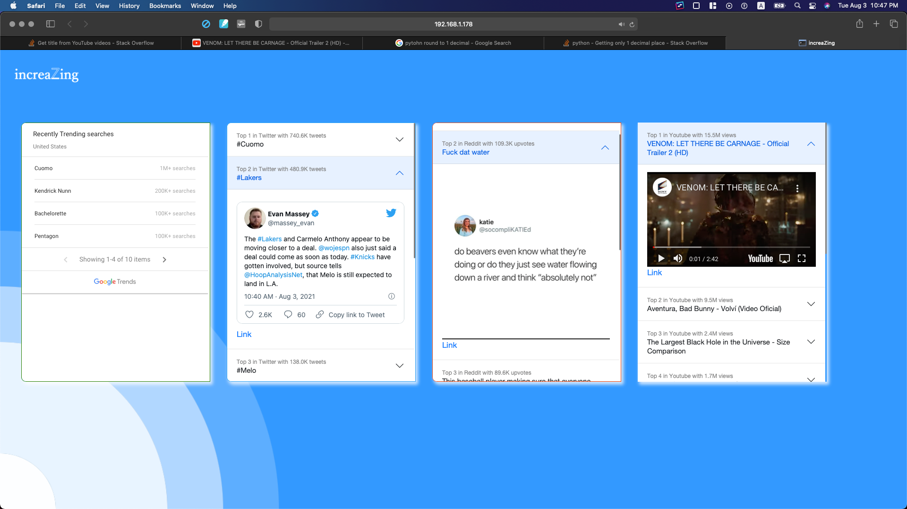

# increaZing
http://www.increazing.com  
Currently I turned off the website server.

https://user-images.githubusercontent.com/67476090/174202634-3a4627f0-8a32-46af-881c-65c8f0f7b950.mp4

# Now available with:
- top 10 trending hashtags from Twitter (using API)
- top 10 trending searches from Google 
- top 10 trending post from reddit (including image or video)
- top 10 trending videos from Youtube

# To-do:
- website design
- add more social media platforms that offer trends API
- Versioning ( different files for production and for development )
- if user click a hashtag or something, scroll move center.

- make website dealing with exceptions.
# Done:
- connected to AWS ec2 (Jul 27 2021)
- website automatically fetch data from social media platforms in the AWS ec2 virtual server (Jul 27 2021)
- domain linked to http://www.increazing.com (Jul 27 2021)
- now the project is using flask development server, but I have to use a server for production deployment 
- why some twitter popular search returns None? -> Fixed. the api should not include '#' in front of hashtag name 
# Used:
- python, html, css
- flask, waitress, bootstrap
- AWS EC2
